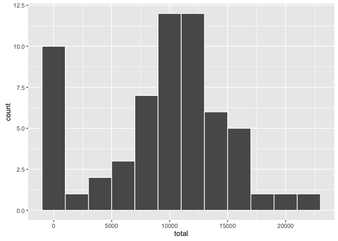
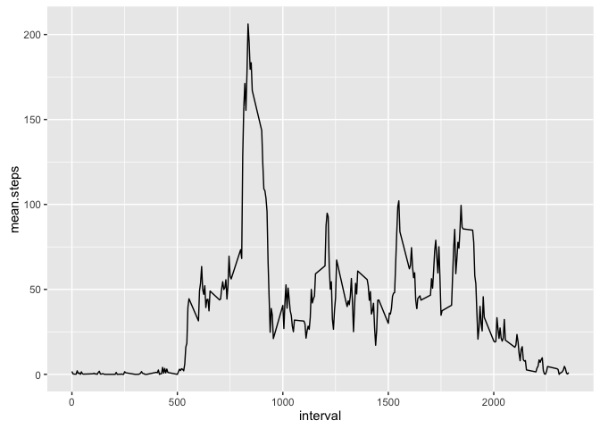
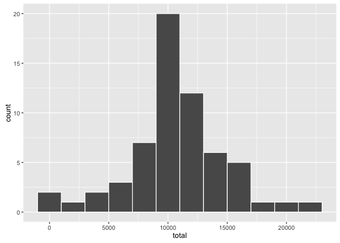
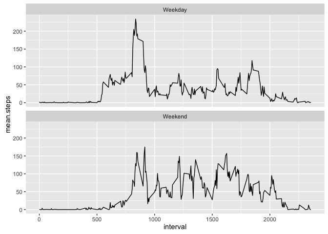

# Reproducible Research: Peer Assessment 1


## Loading and preprocessing the data

Read the csv from the zip, and convert the date column to Date class.

```r
library(data.table)
#unzip('activity.zip')
data <- read.csv('activity.csv')
data$date <- as.Date(data$date)
data <- data.table(data)
```


## What is mean total number of steps taken per day?
Total number of steps per day:

```r
steps.per.day <- data[, .(total = sum(steps, na.rm = T)), by = date]
steps.per.day
```

```
##           date total
##  1: 2012-10-01     0
##  2: 2012-10-02   126
##  3: 2012-10-03 11352
##  4: 2012-10-04 12116
##  5: 2012-10-05 13294
##  6: 2012-10-06 15420
##  7: 2012-10-07 11015
##  8: 2012-10-08     0
##  9: 2012-10-09 12811
## 10: 2012-10-10  9900
## 11: 2012-10-11 10304
## 12: 2012-10-12 17382
## 13: 2012-10-13 12426
## 14: 2012-10-14 15098
## 15: 2012-10-15 10139
## 16: 2012-10-16 15084
## 17: 2012-10-17 13452
## 18: 2012-10-18 10056
## 19: 2012-10-19 11829
## 20: 2012-10-20 10395
## 21: 2012-10-21  8821
## 22: 2012-10-22 13460
## 23: 2012-10-23  8918
## 24: 2012-10-24  8355
## 25: 2012-10-25  2492
## 26: 2012-10-26  6778
## 27: 2012-10-27 10119
## 28: 2012-10-28 11458
## 29: 2012-10-29  5018
## 30: 2012-10-30  9819
## 31: 2012-10-31 15414
## 32: 2012-11-01     0
## 33: 2012-11-02 10600
## 34: 2012-11-03 10571
## 35: 2012-11-04     0
## 36: 2012-11-05 10439
## 37: 2012-11-06  8334
## 38: 2012-11-07 12883
## 39: 2012-11-08  3219
## 40: 2012-11-09     0
## 41: 2012-11-10     0
## 42: 2012-11-11 12608
## 43: 2012-11-12 10765
## 44: 2012-11-13  7336
## 45: 2012-11-14     0
## 46: 2012-11-15    41
## 47: 2012-11-16  5441
## 48: 2012-11-17 14339
## 49: 2012-11-18 15110
## 50: 2012-11-19  8841
## 51: 2012-11-20  4472
## 52: 2012-11-21 12787
## 53: 2012-11-22 20427
## 54: 2012-11-23 21194
## 55: 2012-11-24 14478
## 56: 2012-11-25 11834
## 57: 2012-11-26 11162
## 58: 2012-11-27 13646
## 59: 2012-11-28 10183
## 60: 2012-11-29  7047
## 61: 2012-11-30     0
##           date total
```

Histogram of steps per day:

```r
library(ggplot2)
qplot(total, data = steps.per.day, geom = 'histogram', binwidth = 2000, color = I('white'))
```

<!-- -->

Mean of total steps per day:

```r
mean(steps.per.day$total)
```

```
## [1] 9354.23
```

Median of total steps per day:

```r
median(steps.per.day$total)
```

```
## [1] 10395
```

## What is the average daily activity pattern?

Number of steps across average day:

```r
steps.per.interval <- data[, .(mean.steps = mean(steps, na.rm = T)), by = interval]
qplot(interval, mean.steps, data = steps.per.interval, geom = 'line')
```

<!-- -->

The interval with max steps is:

```r
steps.per.interval[mean.steps == max(mean.steps), interval]
```

```
## [1] 835
```

## Imputing missing values

Total number of missing values in the dataset:

```r
data[is.na(steps), .N]
```

```
## [1] 2304
```

Missing values will be filled with average steps for that interval:

```r
setkey(data, interval)
setkey(steps.per.interval, interval)
data[, steps := as.double(steps)]
data.filled <- steps.per.interval[data]
data.filled[is.na(steps), steps := mean.steps]
```

Histogram of steps per day after imputation:

```r
steps.per.day <- data.filled[, .(total = sum(steps, na.rm = T)), by = date]
qplot(total, data = steps.per.day, geom = 'histogram', binwidth = 2000, color = I('white'))
```

<!-- -->

Mean of total steps per day after imputation:

```r
mean(steps.per.day$total)
```

```
## [1] 10766.19
```

Median of total steps per day after imputation:

```r
median(steps.per.day$total)
```

```
## [1] 10766.19
```

The new mean and median values are different from the values before imputation. Imputation makes the histogram more symetric.

## Are there differences in activity patterns between weekdays and weekends?

Create a new factor indicating weekdays or weekends, and show the difference in day activities:

```r
data[, weekday := factor(ifelse(weekdays(date) %in% c('Saturday', 'Sunday'), 'Weekend', 'Weekday'))]
steps.per.interval <- data[, .(mean.steps = mean(steps, na.rm = T)), by = .(interval, weekday)]
qplot(interval, mean.steps, data = steps.per.interval, geom = 'line') + facet_wrap(~weekday, ncol = 1)
```

<!-- -->


